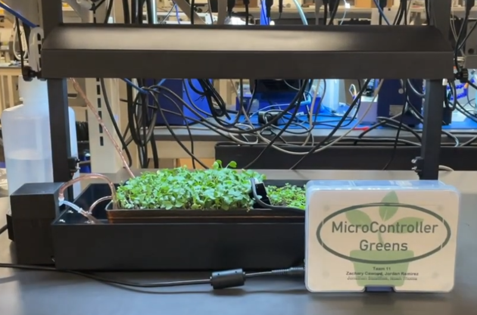
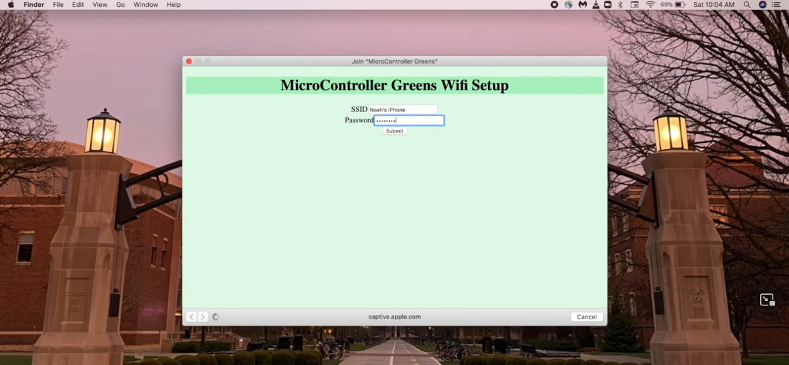
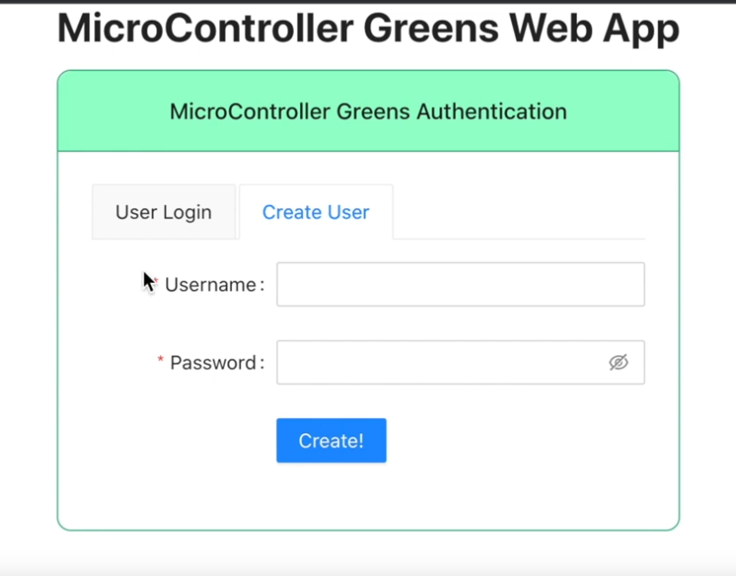
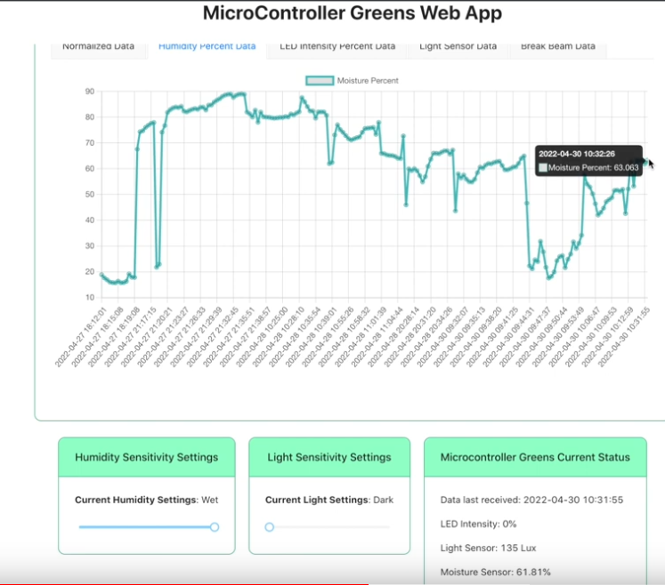

# MicroControllerGreens
## About
Introducing the Micro Controller Greens - a compact, high-tech solution for growing your own herbs and plants at home. This sleek and modern device fits perfectly on any kitchen counter, and allows you to easily control and monitor the growing conditions of your plants via a convenient smartphone app. The grower features advanced automated controls for humidity and light settings, allowing you to customize the environment to perfectly suit the needs of your plants. With its easy-to-use interface and intuitive design, the Micro Controller Greens Grower makes it easy to enjoy fresh, homegrown herbs and plants all year round.

## Video Demo
https://youtu.be/Y8MISCDRqtM?
## Hardware
* Peristaltic Pump 12v
* Soil Moisture Sensor
* ESP-32 Breakout Board
* LED Strips 12v
* Grow Bed Frame
* Step Down Voltage Regulator 12v o 3.3v
* ESP-32 Chips
* Mosfets
* Light Sensor
* Wire to Board Terminal Blocks
* IR Break Beam Sensor 3.3v

## Software
On inital start up the ESP32 microcontroller will use its on board wifi, and configure itself into a creative captive portal. Allowing the at home user to connect to input their wifi information, where the system will then connect to the user's wifi. Once connected the system will connect, every few seconds the ESP32 microcontroller reads from the sensors. Using the onboard wifi chip the ESP32 microcontroller send a GET request to the MySQL database getting the light and humidty sensor prefences and sending the sensor data to the database. 

The user will be able to view all the sensor data and change light and humidity setting on the web app online. Web app: https://github.com/jordan-s-ramirez/microControllerGreensWebsite
